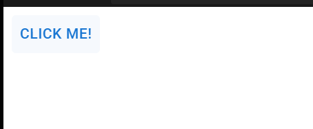
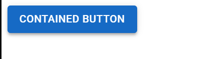
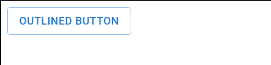
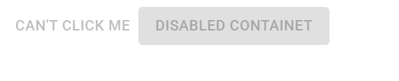

# Buttons
## What is a Button?
Buttons are interactive elements that users click to perform actions. In Material UI, buttons are pre-styled and come with many useful features.  

## Basic Button Import 
First, you need to import the Button component:

``` jsx
import { Button } from '@mui/material';    
```

### Your First Simplest Button
``` jsx  
function MyFirstButton() {
  return (
    <Button>Click Me!</Button>
  );
}   

```   

 


### Button Variants (Most Important) 
Material UI buttons come in 3 main styles.

#### Contained Button (Default)  
``` jsx  
<Button variant="contained">Contained Button</Button>
```    

       
         

#### Outlined Button     
 
``` jsx  
<Button variant="outlined">Outlined Button</Button>

```   
    


#### Text Button    
``` jsx  
<Button variant="text">Text Button</Button>   
``` 
   


### Button Colors
Material UI provides predefined colors:    

``` jsx   
<Button color="primary">Primary</Button>
<Button color="secondary">Secondary</Button>
<Button color="success">Success</Button>
<Button color="error">Error</Button>
<Button color="warning">Warning</Button>
<Button color="info">Info</Button>  
```

### Button Sizes  
``` jsx        
<Button size="small">Small</Button>
<Button size="medium">Medium (Default)</Button>
<Button size="large">Large</Button>  
```
 
### Button States 
#### 1. Disabled Button 
``` jsx 
<Button disabled>Can't Click Me</Button>
<Button variant="contained" disabled>
  Disabled Contained
</Button>  
```    
    

#### 2. Loading Button   

``` jsx  
<Button loading>Loading...</Button>  
```  
### Full Width Buttons 

``` jsx  
<Button fullWidth>Full Width Button</Button>  
```  

### Click Handlers  
Make buttons do something when clicked:  
``` jsx  
export default function MyInteractiveButton() {
  const handleClick = () => {
    alert('Button clicked!');
  };

  return (
    <Button variant="contained" onClick={handleClick}>
      Click Me!
    </Button>
  );
}  
```


### Navigation Button 
``` jsx  
<Button variant="text" href="/about">
  Go to About Page
</Button>   
```


